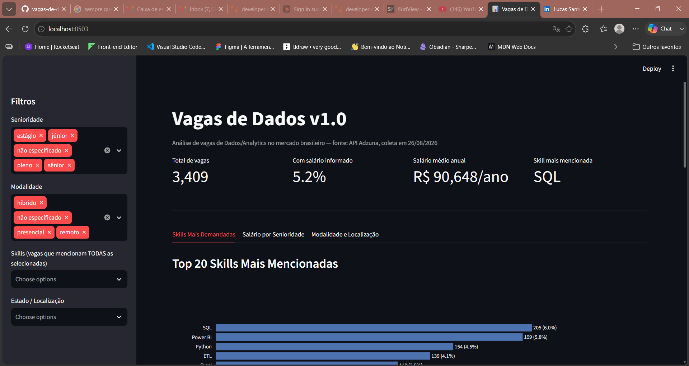

# Vagas de Dados v1.0

Projeto de portfólio desenvolvido por Lucas Santos, estudante de Ciência da Computação (UNINTER) em transição de carreira de Operações para Dados/Analytics. Este projeto analisa vagas reais do mercado brasileiro de Dados para responder três perguntas: quais skills são mais exigidas, como variam os requisitos por senioridade, e como as vagas se distribuem geograficamente (remoto x presencial).

## Objetivo

Analisar vagas reais de Dados/Analytics no mercado brasileiro para identificar as skills mais exigidas, os requisitos por nível de senioridade e a distribuição geográfica (remoto x presencial), gerando um dashboard que apoie minha transição de carreira de Operações para Dados.

## Dashboard

Dashboard interativo em Streamlit com filtros por senioridade, modalidade, skill e estado. Inclui KPIs dinâmicos, gráficos de skills, salário por senioridade e distribuição geográfica/modalidade, além de tabela com links para as vagas originais.



```bash
streamlit run dashboard/app.py
```

## Stack

- **Python** — coleta e tratamento de dados
- **Pandas** — manipulação e análise
- **SQL** — consultas e transformações
- **Streamlit** — dashboard interativo
- **Power BI** — visualizações complementares (em aprendizado)
- **Git/GitHub** — versionamento e portfólio

## Fonte e coleta de dados

- **Fonte:** [API Adzuna](https://developer.adzuna.com/) — endpoint Brasil.
- **Data da coleta:** 26/08/2026.
- **Termos de busca utilizados:**
  - dados
  - analista de dados
  - cientista de dados
  - data analyst
  - data engineer
  - data scientist
  - business intelligence
- **Total de vagas coletadas:** 4.223 (com duplicatas entre termos, a serem tratadas na etapa de limpeza).
- **Limitação conhecida:** alguns termos de busca atingiram o teto de resultados por execução (1.000 vagas), então o volume real de vagas disponíveis para esses termos pode ser maior do que o capturado. A amostra é considerada suficiente para os objetivos do projeto, mas não representa 100% das vagas publicadas.

## Tratamento de dados

- **Deduplicação:** 4.223 → 3.409 registros (814 duplicatas removidas — mesma vaga aparecendo em múltiplos termos de busca).
- **Salário:** 178 vagas (5,2%) com valor informado (real ou estimado pela Adzuna); demais ficaram como nulo, sem inferência.
- **Modalidade** (inferida por palavras-chave explícitas no título/descrição):
  - Remoto: 166
  - Híbrido: 131
  - Presencial: 95
  - Não especificado: 3.017 (88,5%)
- **Senioridade** (inferida por palavras-chave no título):
  - Não especificado: 1.973
  - Sênior: 773
  - Pleno: 366
  - Júnior: 176
  - Estágio: 121
- **Nota metodológica:** a alta proporção de "não especificado" em modalidade e senioridade reflete a ausência dessa informação nas vagas coletadas, não uma falha na inferência — nenhum valor foi assumido sem evidência textual.

## Principais achados

### Skills mais demandadas (top 5)

| Skill | Vagas | % do total |
|-------|------:|-----------:|
| SQL | 205 | 6,0% |
| Power BI | 199 | 5,8% |
| Python | 154 | 4,5% |
| ETL | 139 | 4,1% |
| Excel | 118 | 3,5% |

### Faixas salariais por senioridade (R$/ano)

Apenas 178 vagas (5,2%) informam salário. Valores anuais em reais.

| Senioridade | Mediana (R$/ano) | n |
|-------------|-----------------:|--:|
| Sênior | 106.680 | 23 |
| Pleno | 54.000 | 13 |
| Júnior | 46.398 | 8 |
| Estágio | 24.000 | 11 |

**Nota:** amostras pequenas por categoria limitam conclusões fortes; resultados são indicativos, não definitivos.

### Distribuição geográfica e modalidade

- **Modalidade:** 88,5% não especificado, 4,9% remoto, 3,8% híbrido, 2,8% presencial.
- **Estados:** SP concentra 43,4% das vagas; 26% têm localização genérica ("Brasil", sem estado específico).

## Estrutura do projeto

```
vagas-de-dados/
├── data/
│   ├── raw/          # Dados brutos coletados da API
│   └── processed/    # Dados limpos e transformados
├── notebooks/        # Notebooks exploratórios
├── src/              # Scripts Python (coleta, limpeza, análise)
├── dashboard/        # Código do dashboard Streamlit
└── docs/             # Documentação adicional
```

## Como reproduzir o projeto completo

1. Clone o repositório:
   ```bash
   git clone https://github.com/luthhop/vagas-de-dados.git
   cd vagas-de-dados
   ```
2. Crie um ambiente virtual e instale as dependências:
   ```bash
   python -m venv venv
   venv\Scripts\activate
   pip install -r requirements.txt
   ```
3. Crie um arquivo `.env` na raiz do projeto (baseado no `.env.example`) com suas credenciais da Adzuna:
   ```
   ADZUNA_APP_ID=seu_app_id
   ADZUNA_APP_KEY=seu_app_key
   ```
4. Rode a coleta de dados:
   ```bash
   python src/ingest_data.py
   ```
5. Rode a limpeza e tratamento:
   ```bash
   python src/clean_data.py
   ```
6. Abra o dashboard:
   ```bash
   streamlit run dashboard/app.py
   ```

**Nota:** rodar a coleta novamente vai trazer vagas diferentes das analisadas neste README, já que o mercado muda com o tempo. Os números e achados documentados aqui referem-se à coleta de 26/08/2026.

## Próximos passos (v2)

- Adicionar mais fontes de dados para ampliar cobertura geográfica e reduzir a proporção de "não especificado" em modalidade/senioridade
- Explorar uso de NLP para inferência mais precisa de senioridade e modalidade a partir da descrição completa da vaga
- Fazer deploy do dashboard (Streamlit Community Cloud) para acesso público sem precisar rodar localmente
- Adicionar visualização complementar em Power BI

## Contato

- **GitHub:** [github.com/luthhop](https://github.com/luthhop)
- **LinkedIn:** [linkedin.com/in/lucas-santos-br](https://www.linkedin.com/in/lucas-santos-br/)

## Status do projeto

**Concluído (v1.0)** — setup, coleta, tratamento, análise exploratória e dashboard finalizados.
